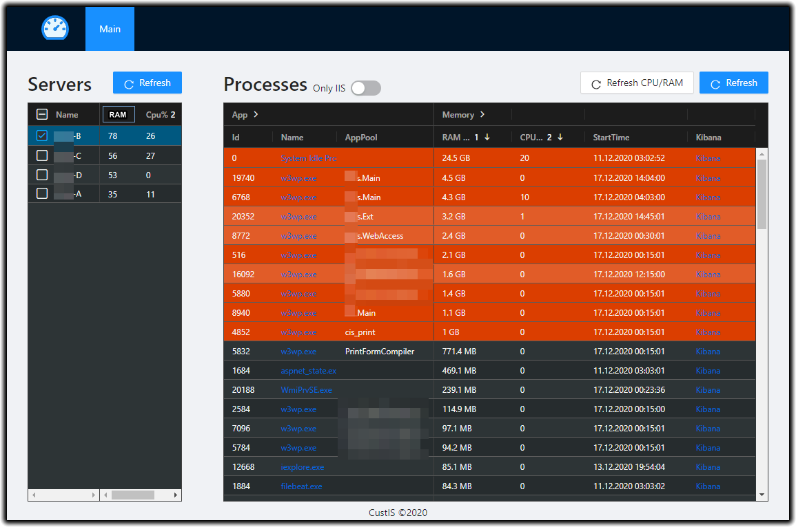
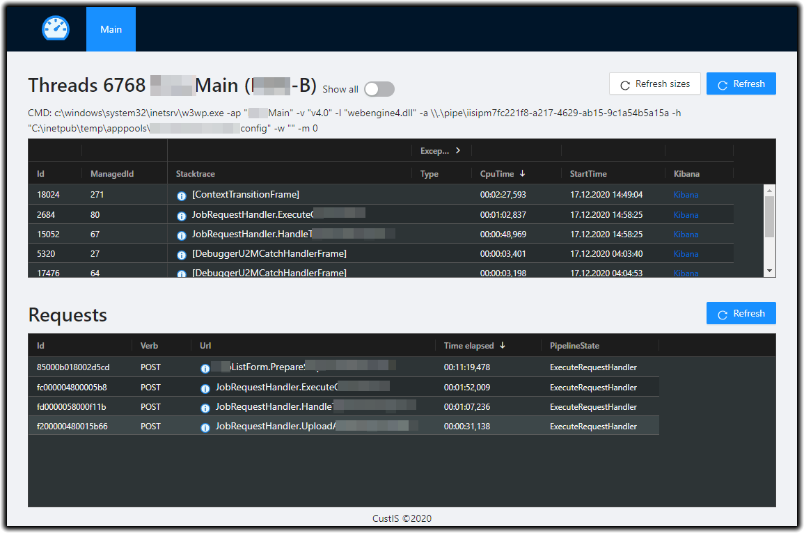

Web application to check running processes on windows machines. Allows to get information from multiple servers. Allows to watch thread stacks of running CLR processes. Allows to watch current executing requests on w3wp workers.

||
-

||
-

# Known limitations #
* Can only inspect processes of same bitness as running web api server

# Repository structure #
* ProcInsp - web application and api's
* ProcInsp.Tests - tests
* Other projects are just for testing purposes

# Run #
* You can run application from VS Code (F5)
* Or dotnet run .ProcInsp/ProcInsp.csporj

# Publish #
* Change version in globalConfig.js
* Run:
  * dotnet publish ProcInsp\ProcInsp.csproj
  * npm run zip
* Create new release at GitHub

# Deploy #
* Prerequsites
  * IIS 
  * dotnet core 3.1
* Download latest release from https://github.com/CUSTIS-public/ProcInsp/releases
* Unzip
* Change config in \ClientApp\build\config.js (all available settings are described in https://github.com/CUSTIS-public/ProcInsp/blob/main/ProcInsp/ClientApp/src/globals.d.ts)
* Deploy to IIS (apppool should be managed by admin user)
