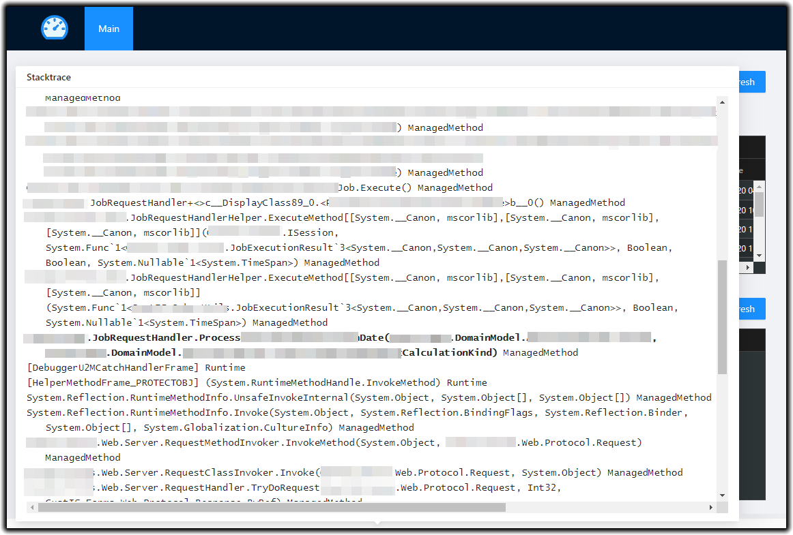

ProcInsp is windows process and stack explorer with web UI. ProcInsp shows list of running processes on multiple (remote) servers. You can drill down into the CLR-process and watch running threads with their stacktraces. ProcInsp also allows to watch current executing requests on IIS AppPools (w3wp workers).

# Servers and procs #

## Features ##

* Displays RAM and CPU usage of connected servers
* Displays info about running processes on all connected servers (RAM, CPU, start time etc)
* For IIS processes - the name of apppool is displayed
* Kibana integration - user can view logs of desired process (logs are filtered by host name and process id; Kibana url in configurable)

# Threads and requests #

## Features ##

* Displays currently running requests (only for IIS processes)
* Displays all running threads of process
* App's entry point in stacktrace is shown as thread's name (which frame should be considered as entry point is configurable)
* If exception in thread occured, exception info is displayed (exception type, message and stacktrace)
* Kibana integration - user can view logs of desired thread (logs are filtered by host name, process and thread ids; Kibana url in configurable)

# Stacktrace #

## Features ##

* Highlight app's entry point in stacktrace (which frame should be considered as entry point is configurable)

# Known limitations #
* Can only show threads and stacktraces of CLR processes with the same bitness as running web api server

# Repository structure #
* ProcInsp - web application and api's
* ProcInsp.Tests - tests
* Other projects are just for testing purposes

# Run #
* You can run application from VS Code (F5)
* Or dotnet run .ProcInsp/ProcInsp.csporj

# Publish #
* Change version in globalConfig.js
* Run:
  * dotnet publish ProcInsp\ProcInsp.csproj
  * npm run zip
* Create new release at GitHub

# Deploy #
* Prerequsites
  * IIS 
  * dotnet core 3.1
* Download latest release from https://github.com/CUSTIS-public/ProcInsp/releases
* Unzip
* Change config in \ClientApp\build\config.js (all available settings are described in https://github.com/CUSTIS-public/ProcInsp/blob/main/ProcInsp/ClientApp/src/globals.d.ts)
* Deploy to IIS (apppool should be managed by admin user)
